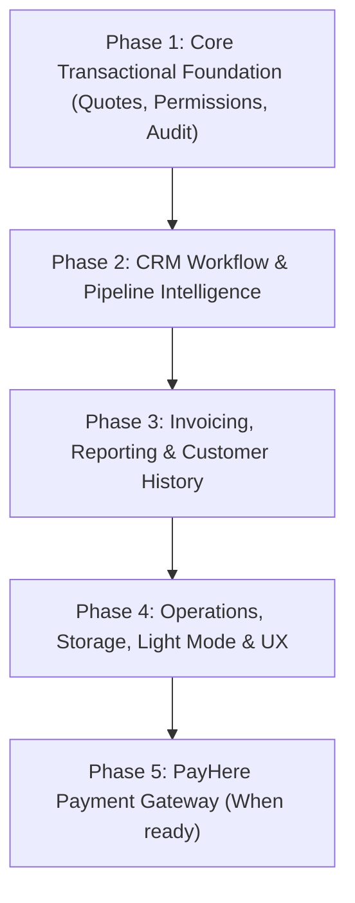

# Print-To-Frame ERP — Feature Implementation Plan (Updated)
### Based on: Industry Benchmark Review Rev-2 × User Feedback × Codebase Audit
**Date:** 2026-08-31 | **System:** React 18 + Vite + Tailwind CSS + Firebase/Firestore (Enterprise Tier)

---

## 💬 Feedback & Responses to Your Comments

| Your Comment / Decision | My Assessment & Strategy | Updated Plan Adjustment |
| :--- | :--- | :--- |
| **1. Payment Gateway:** *"for now lets keep the payment gate way to be added later since i dont have any paid gateways. my go to option is payhere"* | **Strategic Decision:** Excellent choice. We will focus immediately on the direct bank transfer, 75%/25% split invoice flow, and structured accounting records first. The invoice data model and UI will be architected with clean hooks so that PayHere can be connected in Phase 5 with zero database schema refactoring. | **Deferred to Phase 5 / Future Expansion.** Invoice generation, print PDFs, and manual receipt reconciliation remain primary for now. |
| **2. Light Mode:** *"implimented properly."* | **Aesthetic & Accessibility Upgrade:** We will build a true, top-tier light mode theme rather than a quick color inversion. We will map semantic tokens in Tailwind (`data-theme="light"` / `data-theme="dark"`), craft crisp typography, light card containers, neutral borders, high-contrast badges, and add a smooth theme toggle in the UI with `localStorage` + profile persistence. | **Promoted to Phase 4 (Operations & Design).** Full theme system with Kinetic Light Blueprint styling. |
| **3. Firebase Cloud Functions:** *"in a enterprise account with paid eneble"* | **High-Impact Automation Unlocked:** Because your Firebase environment is Enterprise / Blaze-enabled, we have zero technical blockers for backend cron jobs, scheduled reminders (e.g., overdue invoices, stale leads stuck in a stage > 5 days), and server-side webhook/event handlers! | **Full greenlight for Items 7 & 12 backend triggers.** Scheduled checks and notifications will run seamlessly. |

---

## 📊 Summary of Feature Scope (22 Approved Items)

### 🔴 Core Approved Features (21 Active + 1 Deferred Gateway)
- **Quotation System:** Structured line-item records (Item 1), Versioning history (Item 5), Direct Quote→Invoice conversion (Item 6).
- **Access Management:** Action-level permissions `view/create/edit/delete/export` (Item 3), Permission change audit logging (Item 9), User invite/deactivate flow (Item 18).
- **Invoicing & Audit:** Invoice audit trail (Item 8), Due date & Overdue payment reminders (Item 7), Real-time Aging report & period revenue (Item 15), Job-to-Invoice auto linkage (Item 17).
- **CRM Intelligence:** Days-in-stage card surfaces & urgency badges (Item 4), Kanban + List view toggle (Item 10), Multi-select bulk actions (Item 11), Stale-lead alerts (Item 12), Customer duplicate detection (Item 20).
- **Customer Database:** CSV / Excel export (Item 13), Unified customer timeline (Item 14).
- **Operations & UI:** Work order attachments via Firebase Storage (Item 16), Full mobile/tablet responsive breakpoints (Item 19), Full Light Mode theme (Item 21), Modular Dashboard widgets with global filter (Item 22).

### ❌ Explicitly Rejected Features (Will NOT be implemented)
- ~~Configurable multi-pipeline / custom stages~~
- ~~Client-facing e-signature~~
- ~~Time/cost tracking on work orders~~
- ~~Session management (force-logout)~~
- ~~Command palette (Cmd+K)~~

---

## 🏗️ 5-Phase Implementation Roadmap

---

### Phase 1: Core Transactional Foundation (In Progress)

#### 1. Structured Line-Item Quotation Record (Item 1)
- **New Collection:** `quotations` in Firestore.
- **Component:** `src/components/crm/QuotationBuilder.jsx` — structured editable table for line items (Description, Qty, Unit, Unit Price, Total), calculating Subtotal, Grand Total, 75% Advance, and 25% Balance.
- **AI Integration:** Enhanced `generateStructuredQuotation()` in `src/services/gemini.js` returning structured line items matching pricing engine calculations.
- **Lead Modal Integration:** Embedded inside `LeadCardDetails.jsx` alongside existing text notes.

#### 2. Quote Versioning History (Item 5)
- Track `version` numbers (`v1`, `v2`, `v3`) with parent quotation references.
- Version switcher pills to review, clone, or restore historical quote versions.

#### 3. Direct Quote → Invoice Conversion (Item 6)
- One-click "Convert to 75% Advance Invoice" action when quote status is `Accepted`.
- Automatically populates invoice record with line items, advance amount, customer reference, and initial `dueDate`.

#### 4. Action-Level Permissions (Item 3) — *COMPLETED IN CODE*
- Converted permissions schema from `{ read, write }` to `{ view, create, edit, delete, export }`.
- Built 5-action toggle matrix in `PermissionsManager.jsx` (V/C/E/D/X buttons).

#### 5. Invoice & Permission Audit Trail (Items 8 & 9) — *COMPLETED IN CODE*
- Integrated `logActivity()` calls for `INVOICE_CREATED`, `INVOICE_EDITED`, `INVOICE_PAID`, `INVOICE_DELETED`.
- Integrated automated role permission change logging in `PermissionsContext.jsx`.

---

### Phase 2: CRM Workflow & Pipeline Intelligence

#### 1. Kanban Card Days-in-Stage & Urgency Indicators (Item 4)
- Add `stageEnteredAt` timestamp to leads/deals upon every stage transition.
- Calculate `daysInStage` dynamically with colored urgency badges:
  - 🟢 0–3 days (Fresh)
  - 🟡 4–7 days (Attention needed)
  - 🔴 8+ days (Stale / Overdue)
- Display assigned owner initials/avatar on the card face.

#### 2. Sortable / Filterable List View alongside Kanban (Item 10)
- Add view switch toggle (Kanban Board vs. Data Table) in `Leads.jsx` and `Deals.jsx`.
- New reusable component: `src/components/common/ui/SortableTable.jsx` supporting sorting by ID, Customer, Value, Owner, Days-in-Stage, and Date.

#### 3. Bulk Actions Toolbar (Item 11)
- Multi-select checkboxes on table rows.
- Floating action bar: "Bulk Stage Change", "Bulk Assign Owner", "Export Selected to CSV".
- Utilizes existing `batchWrite()` in `firestoreSync.js` for atomic batch updates.

#### 4. Stale-Lead Reminders & Alerts (Item 12)
- Scheduled background checker identifies leads stuck in non-terminal stages > 5 days.
- Dashboard "Attention Required: Stale Leads" panel + in-app notification badges.

#### 5. Customer Duplicate Detection & Smart Matching (Item 20)
- New utility: `src/utils/stringMatch.js` (normalized fuzzy name + phone matching).
- Auto-prompts "Possible match found with existing customer" during lead creation with "Use Existing Profile" action.

---

### Phase 3: Invoicing, Reporting & Customer History

#### 1. Automated Overdue Payment Reminders & Due Date Tracking (Item 7)
- Default `dueDate` set to 7 days from invoice issue date.
- Real-time overdue indicator on unpaid invoices where `today > dueDate`.
- Automated notification trigger alerting sales rep and manager of overdue accounts.

#### 2. Customer CSV Export (Item 13)
- New utility: `src/utils/csvExport.js` generating standard CSV files client-side.
- "Export Customer List" button in `Customers.jsx` header with support for filtered subsets.

#### 3. Unified Customer Timeline (Item 14)
- New component: `src/components/common/ui/ActivityTimeline.jsx`.
- Merges customer leads, quotations, invoices, payments, and fabrication milestones into a unified chronological feed.

#### 4. Real-time Invoice Aging Report & Revenue by Period (Item 15)
- Replace static trend data in `Dashboard.jsx` with real aggregated invoice revenue.
- Add "Aging Analysis" view in Invoices: Current (0–30d), 31–60d, 61–90d, 90d+.

#### 5. Job Completion Hook → Auto-Prompt Invoice Creation (Item 17)
- When a fabrication job in `FabricationWorks.jsx` transitions to `Completed`, prompt the operator to create the final 25% balance invoice with pre-populated data.

---

### Phase 4: Operations, Storage, Light Mode & UX

#### 1. Work Order Attachments (Item 16)
- Connect Firebase Storage for design blueprints, CAD drawings, and site photos.
- New component: `src/components/common/ui/FileUploadZone.jsx` with thumbnail preview, file type validation (PNG/JPG/PDF), and 10MB limits.
- Embed in `FabricationCardDetails.jsx`.

#### 2. User Management Invite / Deactivate Flow (Item 18)
- Admin "Invite User" modal in `AgentDatabase.jsx` / `AdminPanel.jsx` specifying role and permissions.
- Deactivate / Reactivate toggle that revokes user access without deleting historical audit trails.

#### 3. Full Responsive Breakpoints (Item 19)
- Mobile-optimized single-column Kanban with stage accordions.
- Responsive invoice view switching to slide-out drawer on smaller screens.
- Minimum 44px touch targets on all interactive buttons.

#### 4. Proper Light Mode Theme (Item 21)
- Configure comprehensive light-theme CSS variables and Tailwind utility mapping:
  - Clean crisp surface containers (`#f8fafc`, `#f1f5f9`, `#ffffff`)
  - Deep high-contrast text (`#0f172a`, `#334155`)
  - Vibrant accent contrasts with dark & light readability
- Theme toggle switch (Sun / Moon) in Sidebar and Header.
- Theme choice stored in `localStorage` and synchronized with user preferences.

#### 5. Modular Dashboard Widgets & Global Filter (Item 22)
- Break down monolithic dashboard into discrete widget components (`src/components/dashboard/widgets/`).
- Global date range selector (Today, This Week, This Month, This Quarter, Custom) updating all dashboard metrics simultaneously.

---

### Phase 5: PayHere Payment Gateway (Future / When Credentials Ready)

#### 1. PayHere Integration (Item 2)
- `src/services/paymentGateway.js` wrapper for PayHere hosted checkout.
- "Pay Online" link generated on invoices.
- Firebase Cloud Function webhook (`functions/src/paymentWebhook.js`) to automatically mark invoice as Paid upon payment capture.

---

## 🎯 Immediate Next Steps
1. Finish Phase 1: Complete `QuotationBuilder.jsx` and wire it into `LeadCardDetails.jsx` and `App.jsx`.
2. Run build verification (`npm run build`).
3. Proceed directly through Phase 2 and Phase 3.
